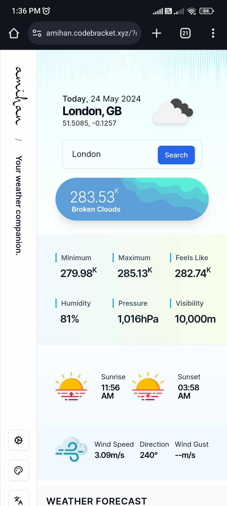
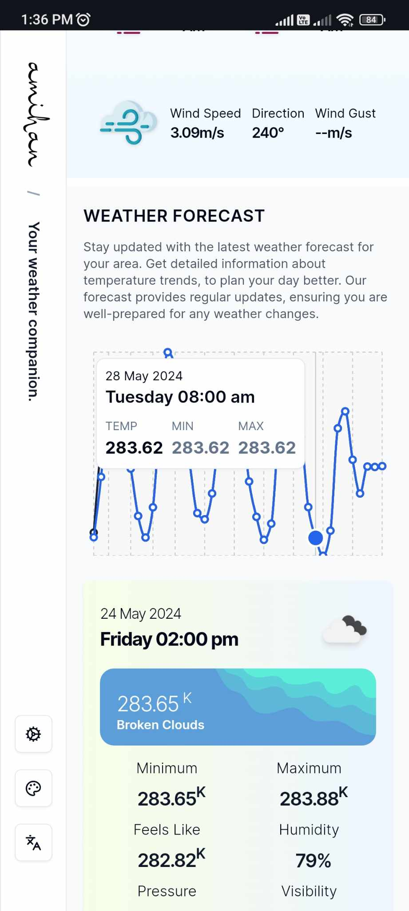
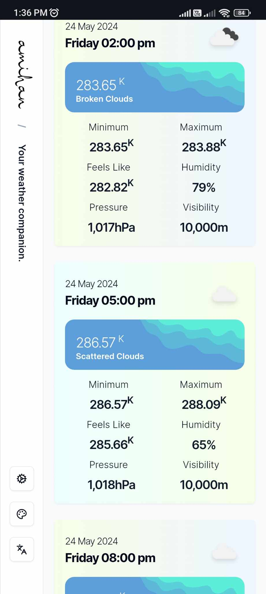

# Amihan App

This application is a weather forecasting tool that leverages the [OpenWeatherMap](https://openweathermap.org/) API to deliver weather updates. It is developed using cutting-edge web technologies, ensuring it is both durable and scalable. The creation of this app serves as a showcase of my full-stack development expertise, as commissioned by CC.Talents.

#### Why "Amihan"?


The name "Amihan" is a Tagalog word that refers to the cool northeast wind or winter storm experienced in the Philippines. This name was chosen for the app because it symbolizes the essence of weather patterns and the importance of understanding and preparing for them.

The Amihan winds are known for bringing cooler temperatures and pleasant weather, making it an apt metaphor for an app that aims to provide accurate and timely weather information. Just as the Amihan winds bring a welcome change to the tropical climate, this app aims to bring a fresh and reliable weather forecasting experience to its users.

##### Demo 👉 [https://amihan.codebracket.xyz](https://amihan.codebracket.xyz)

This is an example frontend for the Amihan application, powered by Next.js.

##### Desktop View


##### Mobile View

<div style="display: flex; justify-content: space-around; align-items: center; flex-wrap: wrap;">
  
  
  
</div>

#### Video Demos

Experience the functionality of the Amihan App through our video demos. Click the links below to download and view each demo:

- **Desktop Demo**: [Download Desktop Demo](https://github.com/raithorivera/amihan-app/blob/main/public/videos/demo/desktop.mp4)
- **Mobile Demo**: [Download Mobile Demo](https://github.com/raithorivera/amihan-app/blob/main/public/videos/demo/mobile.mp4)

---

#### Features

**Amihan App - Your Weather Companion**

**Core Features:**

- 🌦 **Current Weather Conditions**: Get up-to-date weather information including temperature, sunrise, sunset, wind data, pressure, humidity, and visibility for a selected city, using [OpenWeatherMap](https://openweathermap.org/) API.
- 🏙 **Default City**: By default, the app displays weather data for London.
- 🌐 **GeoLocation Support**: If navigator geolocation is enabled, the app automatically uses your lat/lon coordinates to fetch the current weather information.
- 🔍 **City Search**: Allows users to search for and select cities from the OpenWeatherMap database.
- 🔄 **Dynamic Weather Updates**: Utilize `useQuery` to fetch and `useMutation` for sending or mutating data.
- ⏳ **Loading & Error Handling**: Efficiently manages UI states for loading and errors to enhance user experience.
- 📋 **Form Validation**: Implements `zod` and `react-hook-form` to manage and validate form inputs.
- 📈 **Weather Forecast**: Display the weather forecast for the next few days with daily temperature highs and lows graphed for easy visualization.
- 🌈 **Reactive Weather Banners**: Dynamic weather banners that change based on current weather conditions.
- 🌞 **Weather Icons**: Utilizes OpenWeatherMap icons to visually represent weather conditions.
- 📱 **Responsive Design**: A clean, modern design that adjusts beautifully from large screens to mobile devices.
- 📊 **React Query Caching**: Implements caching strategies to optimize data fetching performance.
- 🌡 **Unit Conversion**: Ability to switch the unit of measurement between standard, metric, or imperial.

**Upcoming Features:**

- 🌐 **Multi-language Support**: Plans to accommodate multiple languages to enhance user accessibility.
- 🎨 **Theme Customization**: Future updates will include options to toggle between light and dark themes and choose color themes.

**Technical Highlights:**

- 🖥 **Next.js**: Utilizes Next.js for robust, scalable server-side rendering.
- 🎨 **Tailwind CSS**: Integrated for stylish, responsive design.
- ✅ **TypeScript & Strict Mode**: Ensures reliable code standards and enhances developer experience.
- 🚀 **SEO Optimized**: Implements metadata, and Open Graph tags with Next SEO.
- 🛠 **Developer Tools**: Configured with ESLint, Prettier, and lint-staged to maintain code quality.

##### Explore Amihan

Check out the live site at [amihan.codebracket.xyz](https://amihan.codebracket.xyz) to see these features in action. Discover how Amihan brings comprehensive weather data to your fingertips with ease and style.

---

### Prerequisites

You will need [Node.js](https://nodejs.org) version 18.0 or greater installed on your system.

### Setup

Get the code by either cloning this repository using git:

```
git clone https://github.com/raithorivera/amihan-app.git
```

... or [downloading the source code](https://github.com/raithorivera/amihan-app/archive/master.zip) as a zip archive.

Once downloaded, open the terminal in the project directory, and install dependencies with:

```
npm install
```

### Configuration

Before running the app, you need to set up your environment variables. Copy the `.env.sample` file to a new file named `.env` and fill in the required settings:

```
cp .env.sample .env
```

Edit the `.env` file with your specific values:

- `OPEN_WEATHER_HOST`: Set this to the base URL of your backend API. [https://api.openweathermap.org/data/2.5]
- `OPEN_WEATHER_APP_ID`: You need to obtain your own API key from [OpenWeatherMap](https://openweathermap.org/api). Sign up there and generate an API key to use with this application.

Make sure to replace `OPEN_WEATHER_APP_ID` in the `.env` file with actual values from your setup and OpenWeatherMap respectively.

Then, to start the development server, run:

```
npm run dev
```

The app should now be up and running at [http://localhost:3000](http://localhost:3000) 🚀

---

### Deployment

Deploying the application involves several key steps, ensuring that it is built, managed, and served securely.

1. **Build the Application**:
   Compile the production build of your application by running:

   ```sh
   npm run build
   ```

2. **Start the Application**:
   Check the `start.sh` script to set up the environment and start the application. This script should ensure the correct Node.js and npm versions are used.

3. **Configure Supervisor**:
   Install and configure Supervisor to manage the application process, ensuring it stays running. You will need to create a Supervisor configuration file specific to your application. Check `/server/supervisor.txt` for sample configuration.

4. **Configure Nginx**:
   Use Nginx as a reverse proxy to handle requests and manage SSL. Ensure Nginx is installed and properly configured to route traffic to your application. Check `/server/nginx.txt` for sample configuration.

5. **Set Up SSL with Certbot**:
   Secure your application with SSL certificates from Let's Encrypt using Certbot, it will automatically handle the SSL configuration for Nginx.

#### Restart Services

Once all configurations are in place, ensure to restart the services to apply all changes:

- **Restart Supervisor**:

  ```sh
  sudo supervisorctl restart amihan
  ```

- **Restart Nginx**:
  ```sh
  sudo systemctl restart nginx
  ```

This will compile the production build of the application and start it to the default PORT specified in supervisor.

---

### Project Structure

Below is an outline of the key directories and files in the Amihan project:

```
.
├── .next                    # Compiled output
├── api
│   ├── forecast             # API logic for weather forecasts
│   └── weather              # API logic for current weather data
├── app
│   ├── _components          # Shared React components
│   │   ├── forecast         # Components specific to weather forecasts
│   │   └── weather          # Components specific to current weather data
│   └── _hooks               # React hooks
├── components               # UI components
│   └── ui                   # Basic UI components
├── config                   # Configuration files for the application
├── constant                 # Constants used throughout the application
├── providers                # Context providers for state management, tanstack etc.
├── public                   # Static files like images and favicons
│   └── images               # Image files
├── server                   # Server configurations
│   ├── nginx.txt            # Nginx server configuration
│   └── supervisor.txt       # Supervisor process management config
├── types                    # TypeScript types
├── util                     # Utility functions
├── .env.sample              # Sample environment configuration
├── README.md                # This README file
├── LICENSE                  # The license details
├── package.json             # NPM package configuration
└── tsconfig.json            # TypeScript configuration
```

---

### Technology Stack

#### Frontend

- **Next.js (App Router)**: Provides a hybrid static & server rendering, TypeScript support, smart bundling, route pre-fetching, and more.
- **React.js**: A JavaScript library for building user interfaces, allowing for the creation of reusable UI components.
- **TypeScript**: A strongly typed programming language that builds on JavaScript, giving you better tooling at any scale.
- **shadcn/ui**: A design system built with Tailwind CSS, providing a set of headless and accessible UI components.
- **Tailwind CSS**: A utility-first CSS framework for rapidly building custom user interfaces.
- **Data Fetching**: I used both Axios and Fetch in different parts of the application to demonstrate my proficiency with both technologies. Employing Axios allowed me to showcase advanced features like interceptors and wide browser support, while using Fetch on the server side demonstrated my ability to work with native JavaScript APIs, showcasing versatility and depth in handling HTTP requests across various environments.
  - **Fetch**: A built-in JavaScript API for executing HTTP requests, utilized on the server side within Next.js to retrieve data from the OpenWeather API. This approach was chosen to address Cross-Origin Resource Sharing (CORS) issues effectively and to secure the API key. By handling API requests server-side, we ensure the API key is not exposed in the client-side code, preventing potential hijacking and enhancing overall security.
  - **Axios**: A promise-based HTTP client suitable for both browser and Node.js environments, utilized in conjunction with React Query to handle data retrieval from the server.
- **Tanstack - React Query**: A library for managing server-state in React applications. It makes fetching, caching, synchronizing and updating server state in the applications a breeze.
- **Tanstack - React Hook Form**: TanStack Form is a comprehensive form management solution designed for web applications, featuring robust TypeScript support and framework-agnostic components. It addresses the common shortcomings of web frameworks that lack efficient form handling, by offering features like reactive data binding, complex validations, and extensive support for accessibility and internationalization.
- **Lucide-react**: A collection of simply beautiful open-source icons.
- **date-fns**: A modern JavaScript date utility library.
- **Sonner**: A library for creating beautiful toast notifications.
- **Recharts**: A composable charting library built on React components.
- **Zod**: A TypeScript-first schema declaration and validation library.

#### Backend

- **Ubuntu 24.04 LTS**: A long-term support Linux distribution known for its stability and security, making it ideal for server environments.
- **NVM (Node Version Manager)**: A versatile version manager for Node.js, enabling users to easily switch between different Node.js versions as needed.
- **Node.js v18**: A powerful JavaScript runtime built on Chrome's V8 JavaScript engine, designed for building scalable network applications.
- **Certbot**: A tool that automates the use of Let's Encrypt certificates, enhancing security by enabling HTTPS on servers.
- **Supervisor**: A robust process control system designed for UNIX-like operating systems, which helps in monitoring and controlling multiple processes.
- **Nginx**: A high-performance HTTP server and reverse proxy that excels in handling large volumes of concurrent connections with minimal resource usage. This was used to load-balance and redirect traffic to the correct supervisor app based on subdomain.
- **DigitalOcean**: A cloud infrastructure provider offering Virtual Private Servers (VPS), storage, and networking features, known for its simplicity and scaling capabilities, making it a popular choice for deploying and managing applications and development environments.

---

#### Todo

- Implement UI, Unit, and e2e testing.
- Add animations for weather transitions to enhance visual engagement.
- Social Sharing Options: Enable users to share weather forecasts and conditions on social media directly from the app.

---

#### Attributions

This project uses various resources that require acknowledgment:

##### Illustrations

- The illustrations were provided by [unDraw](https://undraw.co/illustrations). unDraw offers a large collection of open-source illustrations.

##### Weather Icons

- Weather icons used in this application are from [OpenWeatherMap](https://openweathermap.org/), which provides visual representations of weather conditions.
- Additional weather icons from [Vecteezy Weather Icons Pack](https://www.vecteezy.com/vector-art/465658-weather-icons-pack), enhancing our application's visual design.

##### Vector Graphics

- Moon Landscape vectors provided by [Vecteezy](https://www.vecteezy.com/free-vector/moon-landscape). These vectors enhance the aesthetic of our application.
- Weather widget design and UI icons sourced from [Vecteezy's Weather Widget Design](https://www.vecteezy.com/vector-art/8873897-weather-widget-design-ui-user-interface-icon-template), used for creating intuitive user interfaces.

##### Typography

- The logo of Amihan uses the "Rasyideen" font, which is sourced from [DaFont](https://www.dafont.com/rasyideen.font?text=amihan). This font was chosen for its aesthetic and readability.

---

#### Contributions

Everyone is welcome to contribute to this project. Feel free to open an issue if you have question or found a bug.

---

#### License

Licensed under the MIT License, Copyright © 2024

See [LICENSE](LICENSE) for more information.

---

Made with ♥ by **raithorivera**.
